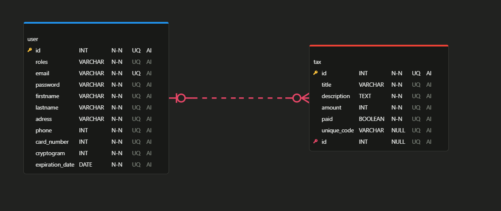

# CosmoTax 🚀

CosmoTax is an innovative intergalactic tax payment platform that aims to revolutionize the way aliens pay their taxes. With a user-friendly interface and a wide range of features, CosmoTax offers a seamless and enjoyable payment experience for users. 👽💸

## Table of Contents

- [Description](#description)
- [Features](#features)
- [Tests](#tests)
- [Form Constraints](#Form-constraints)
- [Database Schema](#database-schema)
- [Technologies](#technologies)
- [Installation](#installation)
- [Configuration](#configuration)
- [Contributing](#contributing)
- [Authors](#authors)
- [Contact](#contact)

## Description

CosmoTax offers a comprehensive tax catalog where users can browse and search for the taxes they need to pay. The platform provides detailed information about taxes, including images and descriptions to help users make informed decisions.

One of the key features of CosmoTax is its intuitive payment system. Users can easily select the taxes to pay, adjust the amounts, and proceed with the payment in just a few clicks. The platform supports various payment methods, ensuring a smooth and secure transaction process.

CosmoTax also prioritizes payment management, allowing users to view and track their payments. Users can easily access their payment history. This feature enhances transparency and customer satisfaction.

## Features

CosmoTax offers a variety of features designed to enhance the user experience on the platform. Here are some of the main features available:

- **Tax Carousel**: Users can browse and search for taxes in the carousel. The carousel provides detailed information, including images and descriptions.
- **Customer Testimonials**: Users can view customer testimonials and scroll them every 5 seconds.
- **Signup and Login**: Users can signup and login to the platform.
- **User Profile**: Users can view their payment history, manage their profile information and generate a unique code to pay the taxes.
- **Alien attack**: If the user does not quickly enter their unique code on the payment page, an alien attack occurs.
- **Payment**: Users can select the taxes (with unique code) to pay and proceed with the payment.
- **Email Confirmation**: After a successful payment, users receive a confirmation email with the payment details.
- **Admin Panel**: The admin panel is used to manage the platform and the taxes.

These features are designed to create a seamless and enjoyable tax payment experience for CosmoTax users.

## Tests

Here is a list of all frontend and backend tests :

| Test | Description | Frontend/Backend |
| ---- | ----------- | ---------------- |
| Display of customer testimonials | Verifies that customer testimonials are displayed correctly and scroll every 5 seconds | Frontend |
| Login form rendering and validation | Tests the rendering of the login form and field validation | Frontend |
| Navbar rendering and conditional display | Verifies that the navigation bar is displayed correctly and that the login/signup or profile/payment buttons are visible based on the login state | Frontend |
| Countdown popup rendering and countdown | Tests the rendering of the countdown popup and verifies that the countdown works correctly | Frontend |
| Signup form rendering | Verifies that the signup form is rendered correctly | Frontend |
| Tax carousel rendering | Tests the rendering of the tax carousel | Frontend |
| Payment form rendering | Tests the rendering of the payment form | Frontend |
| User signup validation | Validates the field constraints during user signup | Backend |
| User authentication | Tests the user authentication process via the API | Backend |

## Form Constraints

Here is a list of form constraints :

| Form | Field | Constraint |
| ---- | ----- | ---------- |
| Signup | Email | Required, valid email format (Yup, Controller) |
| Signup | Password | Required, minimum 6 characters (Yup, Controller) |
| Signup | First Name | Required (Yup, Controller) |
| Signup | Last Name | Required (Yup, Controller) |
| Signup | Address | Required (Yup, Controller) |
| Signup | Phone | Required (Yup, Controller) |
| Signup | Card Number | Required (Yup, Controller) |
| Signup | Cryptogram | Required, exactly 3 digits (Yup, Controller) |
| Signup | Expiration Date | Required, valid date format (Yup, Controller) |
| Payment | Card Number | Required (Formik, Luhn) |
| Payment | Cryptogram | Required (Formik) |
| Payment | Expiration Date | Required (Formik) |
| Payment | Unique Code | Required (Formik) |

## Database Schema

Below is the schema of the CosmoTax database:

## Technologies Used

- **Languages**: HTML, CSS, Tailwind, JavaScript, PHP
- **Frameworks**: Symfony (Backend), Next.js (Frontend)
- **Libraries**: React, Formik, Yup, React Icons, React Loader Spinner, React Slick, React Spring, Framer Motion, Confetti, Mailhog, Easyadmin
- **Database**: PHPmyAdmin, Doctrine ORM
- **Tools**: Node.js, npm, Composer, Git
- **Test**: PhpUnit, Jest

## Installation

To get started with CosmoTax, follow these steps:

1. Clone the repository to your local or production server:
   - Using SSH: `git clone git@github.com:DamienOrecchia38/CosmoTax.git`
   - Using HTTPS: `git clone https://github.com/DamienOrecchia38/CosmoTax.git`    
2. Configure your web server to point to the cloned directory.
3. Ensure Node.js is installed and properly configured on your server.
4. Run `npm install` to install the dependencies.
5. Run `npm run dev` to start the development server.
6. Create the fixtures: `php bin/console doctrine:fixtures:load`

## Configuration

Before running CosmoTax, make sure to configure the `.env` file with your environment settings. This includes database connection details and other necessary configurations.

## Contributing

We welcome contributions from the community to enhance CosmoTax. If you'd like to contribute, please follow these steps:

1. Fork the repository.
2. Create a new branch for your changes.
3. Make your changes and commit them.
4. Push your changes to your fork.
5. Submit a pull request describing your changes.

## Authors

CosmoTax is developed and maintained by Damien Orecchia.

## Contact

If you have any questions or feedback regarding CosmoTax, you can reach out via the following channels:

- Email: [cosmotax@gmail.com](mailto:cosmotax@gmail.com)
- GitHub: [DamienOrecchia38](https://github.com/DamienOrecchia38)

Feel free to contact us, we'll be happy to assist you! 😊